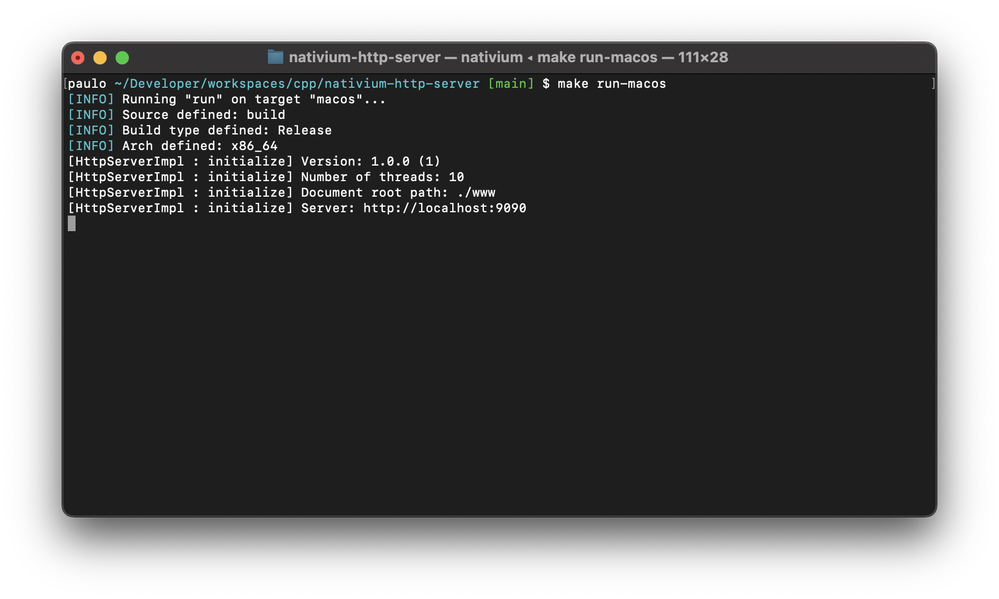

# Nativium - HTTP Server

<p align="center">
    <a href="https://github.com/nativium/nativium-http-server" target="_blank" rel="noopener noreferrer">
        
    </a>
</p>

<br>

<p align="center">
    <a href="https://github.com/nativium/nativium-http-server/actions/workflows/linux.yml"></a>
    <a href="https://github.com/nativium/nativium-http-server/actions/workflows/macos.yml"></a>
    <a href="https://github.com/nativium/nativium-http-server/actions/workflows/windows.yml"></a>    
</p>

<br>

<p align="center">This is a sample about how to use Nativium architecture with custom install to build a HTTP server application with Drogon Framework.</p>

<br>

# General

First of all you need to do the steps of the original [Nativium](https://github.com/nativium/nativium) project.

Visit:

https://github.com/nativium/nativium

# Build for Linux

Execute the following commands to build for Linux:

```
git clone https://github.com/nativium/nativium.git nativium
cd nativium
python3 nativium.py custom install --path=../custom
python3 nativium.py target linux setup
python3 nativium.py target linux build
python3 nativium.py target linux run
```

# Build for macOS

Execute the following commands to build for macOS:

```
git clone https://github.com/nativium/nativium.git nativium
cd nativium
python3 nativium.py custom install --path=../custom
python3 nativium.py target macos setup
python3 nativium.py target macos build
python3 nativium.py target macos run
```

# Build for Windows

Execute the following commands to build for Windows:

```
git clone https://github.com/nativium/nativium.git nativium
cd nativium
python3 nativium.py custom install --path=../custom
python3 nativium.py target windows setup
python3 nativium.py target windows build
python3 nativium.py target windows run
```

Obs: On Windows the terminal needs to be opened as `administrator`, otherwise the `symlinks` will not be created.
